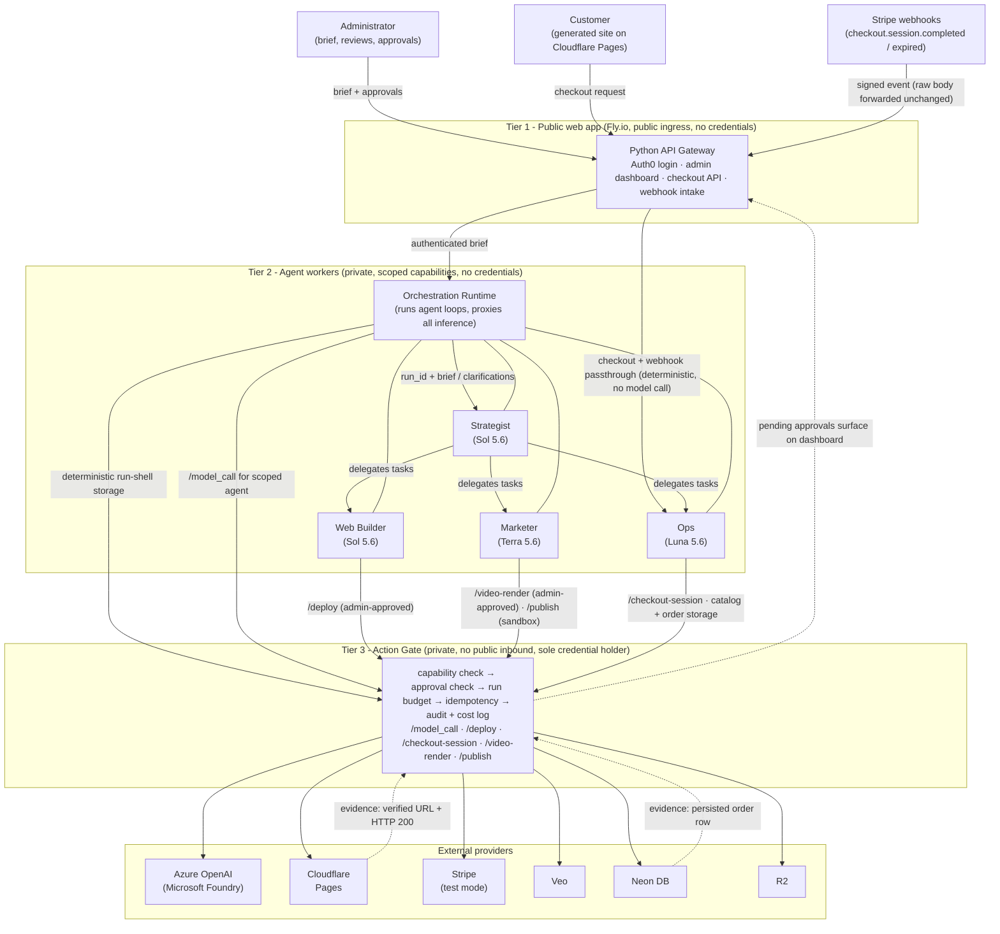

# DESIGN.md — epyhia

epyhia generates a specific type of business infrastructure and marketing from a prompt. An administrator describes a business; the system produces a brand identity, a marketing website deployed to Cloudflare Pages, and a marketing pack, then runs the business's customer-facing checkout. One tenant is tied to one business. Longer term the generated sites might be provisioned per-repo in GitHub, but that is not in scope here.

## 1. The sample business

**Party Rentals** — a local party rentals business for residential and small-business events. It rents tables, chairs, tents, generators, and audio systems. Rentals are for specific quantities of items over a fixed term.

Charging model: pay in full at booking. For each item, `qty × day_rate × rental_days`, summed across the reservation. All money is handled in integer cents to avoid floating-point math.

Out of scope for the business: late fees, customer alerts or reminders, backend delivery scheduling, worker tracking, and security deposits.

Safety defaults for the whole system: Stripe always uses test-mode keys. Email goes only to a configured mail catcher. Social publishing produces drafts or sandbox records, never real posts. All actions default to TEST and the gate rejects unsupported LIVE actions.

## 2. Architecture: three tiers

**Tier 1** is the public web app: a Python (FastAPI) API Gateway on Fly.io handling Auth0 login, the admin dashboard, the customer checkout API, and Stripe webhook intake. It is reachable from the internet and holds no credentials.

**Tier 2** holds the agent workers: the Orchestration Runtime plus Strategist, Web Builder, Marketer, and Ops. Tier 2 is reachable only from Tier 1, receives scoped capability handles, has no public ingress, and holds no credentials — not even DB credentials. Agents are independently scalable.

**Tier 3** is the Action Gate. It is reachable only from Tier 2, has no public inbound, and exclusively holds the Azure OpenAI, Cloudflare, Stripe, Veo, Neon, and R2 credentials. Agents get capability handles, never keys. Even a misprompted agent cannot reach a provider directly.

All three tiers deploy to Fly.io as separate apps. Stripe webhooks enter through Tier 1; Tier 1 and Tier 2 forward the raw request body and Stripe signature unchanged to Tier 3, where signature verification happens before any processing.

Secrets never live in the repository. Every provider credential exists only as a Fly.io secret on the Tier 3 app. `.env` is git-ignored, and a committed `.env.example` lists every required variable with no values — a clean clone contains no key material at all.

An important nuance on the customer path: checkout and webhook traffic passes through Ops' capability scope, but it is deterministic passthrough code. No model call sits in the payment path. Ops the *agent* (an LLM loop) only acts during onboarding; Ops the *capability scope* is what the checkout passthrough runs under.

## 3. The crew

Hub-and-spoke: the Strategist coordinates three specialists. There is no agent-to-agent mesh, and the Strategist never invokes the Action Gate directly — it delegates only.

| Agent | Model | Why this tier | Allowed external effects (via gate) |
|---|---|---|---|
| Strategist | Sol 5.6 ($5/$30 per 1M in/out) | The brand doc carries the core intelligence and GTM approach; this is where max reasoning pays for itself | None. Clarification and delegation only |
| Web Builder | Sol 5.6 | Good code generation, must consume brand-doc guidance and avoid AI slop. Design earns customers, so this is <$1 of spend on the thing customers actually see | Site storage, approved deploy requests |
| Marketer | Terra 5.6 ($2/$12) | Copy generation with self-review; doesn't need frontier reasoning | Artifact storage, approved video-render requests, sandbox publishing |
| Ops | Luna 5.6 ($0.20/$1.20) | Directed business actions, no independent reasoning needed | Catalog/reservation storage, Checkout Session requests, persisted-order verification |

(Pricing as of August 8, 2026, short context.)

Tier 3 rejects any requested capability not explicitly allowed for that agent. Capability authorization never replaces the required administrator or customer approval — they are checked separately.

The Strategist accepts the initial prompt, generates the brand doc, and creates work for the Marketer, Web Builder, and Ops. It does not initiate deployment, video generation, or customer payment actions, and holds no credentials of any kind.

The capability allow-list implies each agent's boundary, but the boundaries deserve to be stated as hard negatives:

- The **Strategist** may never invoke the Action Gate for an external effect, hold a credential, or touch a provider. Delegation only.
- The **Web Builder** may never touch Stripe or any payment code path, request a checkout or publish action, or deploy without a payload-hash-bound admin approval.
- The **Marketer** may never send or post outside the sandbox and mail catcher, trigger a Veo render without the exact payload-and-cost approval, or make a claim not grounded in the brand document and catalog.
- **Ops** may never request a LIVE-mode action, deploy, publish, or mark its own work verified — the gate independently confirms the persisted order row rather than trusting the agent's report.

## 4. The Action Gate

The gate is the sole credential holder and the single chokepoint for every external effect. Every request goes through the same pipeline: capability check → approval check → run budget check → idempotency check → audit and cost log → execute.

Endpoints: `/model_call`, `/deploy`, `/checkout-session`, `/video-render`, `/publish`.

- `/model_call` — all LLM inference, proxied by the Runtime for whichever agent is running, constrained by the per-run budget the administrator approved up front.
- `/deploy` — pushes a site to Cloudflare Pages. Public, live action: requires admin approval bound to the deployment payload hash.
- `/checkout-session` — creates Stripe Checkout sessions (test mode). Customer approval is inherent: the customer initiates and completes the checkout themselves.
- `/video-render` — Veo generation (via kdowswell/veo-tools). Paid action: disabled until the administrator approves the exact storyboard/payload and cost.
- `/publish` — social/email output to sandbox and the mail catcher only.

Three kinds of authorization, checked independently:

1. **Capability** — is this agent allowed to *request* this action at all?
2. **Admin approval** — has a human approved this exact brand-document version, marketing-pack version, deployment payload, publish, or video payload? Approval is bound to a payload hash and applies to that specific payload only. An unexecuted approval derived from a superseded version is rejected.
3. **Customer approval** — expressed through the public Stripe checkout flow.

Every gated action is recorded with: run_id, tenant_id, agent_name, action, destination_url, destination_params, cost, approved_by, timestamp, idempotency_key, status (pending_approval / approved / executed / failed), mode (test/live), payload_hash, approved_at. The actions log is the audit table. Credentials and unredacted payment data are never stored in audit payloads.

## 5. Flow 1 — Business creation (interactive, 2–5 minutes)

1. The administrator logs in and enters a business description prompt in the admin dashboard.
2. Tier 1 forwards the authenticated submission and administrator identity to deterministic control-plane code in the Orchestration Runtime. The Runtime requests a plain Action Gate storage action — no LLM call — to create the onboarding request and run shell in one transaction. The shell has status CREATED, the original brief and its hash, the administrator-approved budget and approver identity, and a NULL brand_document_id. Retrying the same (tenant_id, idempotency_key) returns the existing run_id. Tier 1 never calls Tier 3 directly. Run-shell creation is deterministic control-plane work and is never routed through an Ops model call.
3. The Strategist checks the brief's completeness against that run_id — including whether there's enough data to populate the business catalog. If the prompt is incomplete, missing information is gathered by interactively asking the administrator through Tier 1. The final output is a fully populated prompt: the brief consists of the required items whether or not the original prompt included them.
4. The Strategist produces the completed brief, brand identity document, and task plan. Every inference is routed by the Runtime through the Action Gate and logged against the run shell.
5. The Strategist delegates finalization to Ops. Ops invokes the Action Gate to persist a new brand-document version with PENDING approval, set the run's brand_document_id, create the task records (initial catalog population is itself a task), and transition the run to AWAITING_BRAND_APPROVAL.
6. The dashboard shows the completed brief and the exact versioned brand document for review. The Web Builder and Marketer remain blocked at the Action Gate while the brand document is PENDING. Administrator approval is bound to the brand-document id and content hash; the Runtime then automatically starts both downstream generators with stable, replay-safe identities.
7. The Web Builder generates and reviews the HTML/CSS from the approved brand document. The dashboard presents it in a sandboxed preview. Only a separate payload-hash-bound admin approval may push the exact reviewed site to Cloudflare. Verification then happens in two steps, both performed by the gate rather than the agent: the URL must answer with HTTP 200, and a synthetic end-to-end purchase must succeed against the live site — a reservation created through the public checkout path and completed with Stripe's test card (headless completion of the hosted checkout, or a Stripe-CLI-triggered completed event bound to that synthetic reservation; the mechanism is a build-time decision), asserting that exactly one synthetic-flagged order row persisted. Only after both checks pass is the deployment marked verified, the URL stored, and the task table updated. A live URL whose checkout does not take money is not a deployed business.
8. The Marketer generates the landing copy, 3–5 social posts, a launch email, and a video storyboard, stored in tenant-scoped marketing_artifacts and displayed together. Approval is bound to the complete marketing-pack hash. Only after pack approval does the dashboard expose the separate exact-payload-and-cost approval for Veo rendering — a landscape launch video plus a second Veo invocation for the vertical social cut, capped at 5 Veo generations per tenant across both outputs.
9. Dashboard state comes from background polling against the task table.

**Request changes** is offered at every review, with required administrator feedback. A brand or business-fact change creates a new strategy run and brand-document version, then regenerates both downstream deliverables after brand approval. Website-only or marketing-only feedback creates a separate traceable revision run that reuses the approved brand and catalog and regenerates only that artifact. Prior versions stay immutable.

## 6. Flow 2 — Customer checkout (party rentals)

1. The customer selects one or more items on the public site and checks out. The browser sends only item IDs, quantities, rental dates, and customer details — never an authoritative price, total, currency, or tenant ID. Tenant identity comes from the site/host mapping or authenticated context.
2. The backend loads or inserts the customer row by normalized email, checks availability, and inserts a reservation with PENDING status. PENDING reservations count against availability. Availability checks use SELECT FOR UPDATE on quantities and validate date overlaps, so double-booking is prevented at the database, not by hope.
3. Tier 3 loads catalog prices from Neon, validates date overlap and availability, calculates rental days and the total in cents, and creates the Stripe line items. It creates the Checkout Session (test mode) with an idempotency key derived from the reservation ID, and returns the session URL.
4. On completion, Stripe redirects the customer back and separately fires the `checkout.session.completed` webhook. The handler verifies the Stripe signature in Tier 3 before processing, and compares the Stripe amount and currency against the persisted reservation.
5. In one transaction: record the webhook event, insert exactly one order (only if payment_status is PAID) with status PAID and the payment_timestamp from Stripe, and flip the reservation PENDING → CONFIRMED. Anything fails, everything rolls back. Duplicate events return success without creating anything new.
6. The customer-facing transaction status is answered by querying the DB, not by trusting the success redirect.

## 7. Flow 3 — Expired reservations (abandoned checkout)

If a customer reserves but never pays, the PENDING reservation is blocking inventory. Stripe Checkout expiration is set to 1 hour; the `checkout.session.expired` webhook cancels the reservation and releases availability.

## 8. Data model

Neon (Postgres) for structured data, Cloudflare R2 for binary artifacts (videos). Money is stored as integer cents (customer-facing) or integer microdollars (internal cost tracking) — never floats.

**tenants** — a tenant is a customer of epyhia: id, name, email, business_name, business_slug, business_email, business_phone, business_address.

**runs** — id, tenant_id, original_brief, completed_brief, brief_hash, brand_document_id, approved_budget_microdollars, budget_approved_by, status, created_at, completed_at. `runs.total_cost_microdollars` is not a column: it is derived by query from agent_calls.cost_microdollars + actions.provider_cost_microdollars.

**onboarding_requests** — id, tenant_id, idempotency_key, run_id (FK runs.id), created_at. Unique (tenant_id, idempotency_key).

**tasks** — id, tenant_id, run_id, task_type, status, output_ref, updated_at. Unique (run_id, task_type). This drives the admin dashboard; retrying a failed task updates the existing row rather than inserting a second logical task.

**agent_calls** — id, run_id (FK), task_id (FK), agent_name, model_id, model_tier, input_tokens, cached_input_tokens, output_tokens, cost_microdollars, status, started_at, completed_at.

**actions** — id, tenant_id, run_id (FK), agent_name, action_type, payload_hash, idempotency_key, mode, approval_status, approved_by, approved_at, provider_reference, provider_cost_microdollars, status, created_at, executed_at. Unique (tenant_id, action_type, idempotency_key). This is the audit log.

**brand_document** — id, tenant_id, version_number, full_text. Unique (tenant_id, version_number). Versioning table; full text lives in the DB.

**marketing_artifacts** — id, tenant_id, run_id (FK), brand_document_id, artifact_type, sequence_number, channel, text_content, r2_object_key, mime_type, self_review_status, grounding_check_status, review_feedback, approval_status, approved_by, approved_at, created_at, updated_at. artifact_type ∈ {LANDING_COPY, SOCIAL_POST, LAUNCH_EMAIL, VIDEO_STORYBOARD, VIDEO_LANDSCAPE, VIDEO_VERTICAL}. Unique (run_id, artifact_type, sequence_number). Text artifacts must have non-empty text_content; video artifacts must have r2_object_key and mime_type. Every artifact references the brand-document version that produced it. The self-review and factual-grounding check must both pass before an artifact becomes approval-eligible, and storyboard approval precedes the paid render. Reruns create artifacts under a new run_id — they never overwrite an earlier pack. A marketing run is COMPLETE when it contains 1 landing copy, 1 email, 1 storyboard, 1 landscape video, 1 vertical video, and 3–5 posts, all referencing the same brand_document_id.

**rental_items** — id, tenant_id, name, description, available_qty, day_rate.

**customers** — id, tenant_id, name, email, normalized_email (= lower(trim(email))). Unique (tenant_id, normalized_email).

**reservations** — id, tenant_id, customer_id, start_date, end_date, status, total, stripe_checkout_session_id, is_synthetic, created_at.

**reservation_items** — id, reservation_id, rental_item_id, qty, day_rate.

**orders** — id, created_at, tenant_id, reservation_id, stripe_checkout_session_id, amount, currency, status, payment_timestamp, is_synthetic. reservation_id and stripe_checkout_session_id are each separately unique — the DB itself makes "one order, never two" true. is_synthetic marks the go-live verification purchase (Flow 1, step 7): excluded from business reporting, retained as go-live evidence.

**webhook_events** — id, created_at, stripe_event_id (primary key). Stripe retries webhooks; this table is the dedupe.

**deployments** — id, tenant_id, cloudflare_project_name, live_url, last_action_id, verified_at, updated_at. Unique (tenant_id) and unique (cloudflare_project_name).

run_id must connect brief → tasks → agent calls → actions, end to end.

## 9. The brand document

Contents: business story (background, mission, strengths, target demographic), logo and logo usage guidance, typography rules, writing tone and grammar guidance, color palettes, imagery dos and don'ts, layout template guidance for social media, and contact details.

The Strategist writes it; everything downstream reads the approved version. If it changes via the dashboard, a new version row is created and the website and marketing sequence re-runs against it.

## 10. Idempotency

**Onboarding.** Retrying the same (tenant_id, idempotency_key) returns the existing run and dashboard. A new key intentionally creates a new run and brand version for the same tenant business and deployment. brief_hash may warn the administrator that identical content was submitted before, but it does not enforce idempotency — a warning, not a lock.

**Deployment.** One Cloudflare project per tenant; a re-deploy overwrites, it never creates a second site.

**Stripe.** The checkout idempotency key is derived from the reservation id, and the webhook handler dedupes by Stripe event id.

**Tasks.** Retrying a failed task reuses the existing (run_id, task_type) row.

## 11. Avoiding AI slop

Two separate problems, two separate mechanisms.

**Design quality (the site looking like AI made it).** From my research, the low-hanging fruit is the prompt itself: not "create a local rental business site" but a parameterized template in the shape of "create a high-converting landing page for a local rental business targeted at X — a headline, one sentence under it, an easy way to build trust, answers to the customer's questions, a way to contact us, an accordion FAQ, light visual theme, mobile-first, designed for a local business rather than a corporate one" — combined with the brand document. (Reference: superdesign.dev/blog/ui-design-prompts.) On top of that, an independent LLM review (Terra 5.6) takes the brand document and the *rendered* HTML — judged on mobile and web rendering, not source code — and returns either approval or specific feedback, capped at 3 revision rounds.

**Factual accuracy (the copy lying).** Non-LLM checks: cross-check prices on the HTML against the database catalog; regex for lorem ipsum and TODO; check contact details match tenant details; validate hyperlinks, HTML validity, image validity, viewport meta presence, and that URLs return 200. Plus the marketing prompt explicitly instructs honesty — no invented reviews or testimonials.

## 12. Failure catalogue

Entries 1–5 and 8 are grounded in documented failures of Polsia, the real product this assignment is modeled on; 6 and 7 are specific to the rental business.

1. **Tenant paid for business creation but got no deployed website.** The most-repeated complaint in Polsia's Trustpilot reviews: tasks marked "complete" by the AI that never actually deployed. On deploy, the gate independently verifies the deployed URL returns 200 — it never trusts the agent's self-report. A failed deploy gets one retry, then alerts the epyhia administrator; the tenant sees a message that the failure is logged and being investigated.
2. **Marketing copy doesn't match the tenant's wishes — off-brand or inaccurate claims.** Polsia users reported automated outreach sent with wrong names and wrong prices. Human review of the full marketing pack, hash-bound approval, plus the Marketer's self-review and grounding check gating approval-eligibility.
3. **Business customer gets double charged on crash or retry.** Polsia reviews describe credits burned on failed and duplicate work, and unexpected repeat charges. Stripe idempotency key derived from reservation id, webhook dedupe by event id, and unique constraints on reservation_id and stripe_checkout_session_id in orders.
4. **epyhia can't control costs.** Polsia's founder admitted "I lose money on every customer today" — uncontrolled per-task model spend. Irreversible or paid actions — publish, go-live, video generation — go through human review at the gate, bound to exact payload and cost. LLM spend is capped by the per-run budget approved up front. Customer-initiated charges are already human-approved by definition.
5. **Fabricated social proof lands in a tenant's marketing.** Polsia's ads agent generates UGC-style AI "testimonials" — invented endorsements published as if real. The marketing prompt requires honesty and forbids invented reviews/testimonials; the grounding check must pass before anything is approval-eligible.
6. **Customer receives an inaccurate reservation confirmation / double booking.** Availability checked with SELECT FOR UPDATE plus date-overlap validation before booking; PENDING reservations count against availability; confirmation status is read from the DB, not the redirect.
7. **Website descriptions or prices drift from the DB catalog.** After generation, a programmatic check compares the website against catalog descriptions and prices before deploy approval.
8. **The site is live but the checkout is a shell.** An independent audit of Polsia's "launched" businesses found cosmetic landing pages with no sign-up, no payment integration, and no way to buy anything — while the dashboard counted them as launched. Go-live verification therefore includes the synthetic end-to-end test purchase (Flow 1, step 7): the deployment is not marked verified until exactly one synthetic-flagged order row has actually persisted through the real checkout, webhook, and DB path.

## 13. Tech stack

Marketing sites: Cloudflare Pages. Backend: Python (FastAPI) API Gateway plus Python backend workers on Fly.io. Storage: Neon (Postgres) and Cloudflare R2. Auth: Auth0. Models: GPT-5.6 Sol / Terra / Luna served by Azure OpenAI (Microsoft Foundry), through the gate's /model_call. Video: Veo via kdowswell/veo-tools. Admin dashboard frontend: React + Vite, served as static assets by the Tier 1 gateway.

No agent framework. The gate's /model_call speaks the OpenAI chat-completions shape, and Tier 2 agents reach it through a thin HTTP client — the agent loops are hand-rolled hub-and-spoke. A framework's provider abstractions are exactly the thing the gate centralizes; keeping the loop thin makes a direct provider call structurally impossible rather than merely forbidden.

This footprint is a deliberate tradeoff. Three Fly.io apps plus Cloudflare Pages, Neon, R2, Auth0, and Veo is a lot of surface for a two-week solo build, and it puts pressure on running from a clean clone. The isolation is worth it: the credential boundary is the core of the system, and with this shape a compromised or misprompted agent cannot reach a provider even in principle — the keys are in a process it cannot dial. The mitigation is operational, not architectural: one bootstrap script provisions and deploys all three apps from `.env.example`, so a clean clone still comes up with a single command.

## 14. Proving it

The rubric is checked by an eval the repo ships, not by claims. `eval/rubric.json` defines the criteria; `eval/eval.py` runs them against the deployed agency and writes `PRODUCT_EVAL.md`. The automated checks:

- The stored live URL answers with HTTP 200 and contains the tenant's brand marker.
- A scripted test purchase through the public checkout persists exactly one order row.
- Every external effect has an actions row with cost populated, and run_id connects brief → tasks → agent calls → actions end to end.
- Re-submitting the same (tenant_id, idempotency_key) returns the existing run: no second Cloudflare deployment, no duplicate order.
- agent_calls shows the model tier split: Sol on strategy and site generation, Terra and Luna on execution.
- Editing the brand document creates a new version and regenerates the downstream artifacts against it.

The demo (60–90 seconds): a brief goes in, the brand document is approved, the deploy is approved, the live URL opens, a test card completes checkout, the order row is shown in the database, and a re-run of the same brief produces no duplicate site and no duplicate order.

From a clean clone: `.env.example` documents every required variable, and one bootstrap command provisions and deploys the three Fly.io apps.