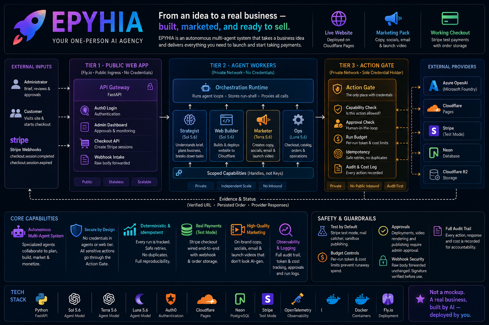
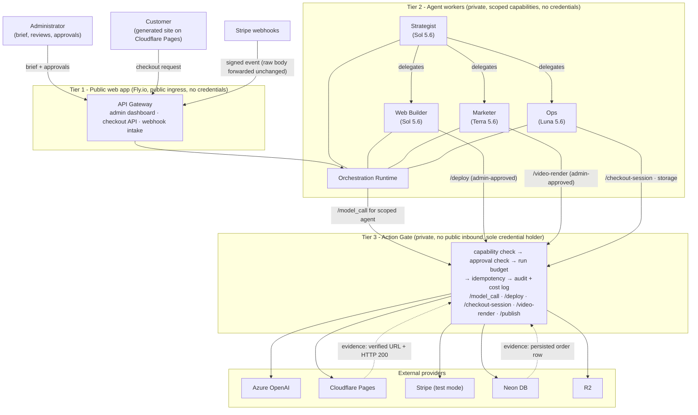

# EPYHIA — a one-person AI agency

[](https://github.com/Bhardwaj-Saurabh/EPYHIA_AI_agency/actions/workflows/deploy.yml)
[](PRODUCT_EVAL.md)
[](https://epyhia-gateway.fly.dev)
[](pyproject.toml)
[](apps/dashboard)
[](DESIGN.md)
[](DESIGN.md)



**A business brief goes in. A real business comes out:** a live website on a real
URL, a grounded marketing pack with a launch video, and a working Stripe
checkout where a completed test purchase writes an order row to a real
database. Built, marketed, and ready to sell — by a crew of four AI agents that
can spend money and publish to the world, but only through one audited door.

**Scores [100/100](PRODUCT_EVAL.md) on its own evidence-based evaluation suite.**

| See it live | |
|---|---|
| 🐕 **A business it built** — The Biscuit Barn (pet boarding) | [epyhia-biscuit-barn.pages.dev](https://epyhia-biscuit-barn.pages.dev) — book a stay with Stripe test card `4242 4242 4242 4242`; the order really persists |
| 🚲 **Another one, same system, new brief** — Dales Wheels (bike hire) | [epyhia-harrogate-bike-hire.pages.dev](https://epyhia-harrogate-bike-hire.pages.dev) |
| 🎛️ **The agency itself** — Action Gate console | [epyhia-gateway.fly.dev](https://epyhia-gateway.fly.dev) — live runs, per-agent model costs, approvals, and the full audit log |

---

## The problem

A small business owner — a kennel, a bike shop, a bakery — needs three things
to start taking money: a website, marketing that doesn't misrepresent them, and
a way to get paid. Today that means either thousands of pounds and weeks with
an agency, or stitching together site builders, copy tools, and payment
providers themselves. The demand is real, the work is formulaic — which is
exactly why a wave of autonomous "AI business builder" products has appeared to
sell it as a service.

## Why the existing products fail

I studied the most prominent of them before designing anything, and its public
track record is the actual problem statement. Customers reported: tasks marked
**"complete" that never deployed**; outreach sent with **wrong names and wrong
prices**; **duplicate charges** on retries; and "launched" businesses that were
**cosmetic landing pages with no working way to buy anything** — while the
dashboard counted them as live. Its own founder admitted losing money on every
customer from uncontrolled model spend.

The diagnosis: none of these are generation failures — today's models write
good copy and good pages. They are **governance failures**. The systems let
agents spend money and publish to the world on their own say-so, trusted their
self-reports as status, and had no idempotency around retries. The moment an
agent can ship and charge, "it looked fine in the demo" stops being good
enough.

## The solution

EPYHIA is a one-person AI agency built on the opposite assumption: **agents
lie, crash, and hallucinate — so verify everything against reality, and put
one audited, human-controlled door in front of anything irreversible.** The
generation is the easy half; the product is the trust layer around it. The
full failure catalogue and the control that answers each entry is in
[DESIGN.md §12](DESIGN.md#12-failure-catalogue).

Four specialist agents behind a single **Action Gate** (three-tier isolation, all on Fly.io):

| Agent | Model tier | Job | May never |
|---|---|---|---|
| **Strategist** (orchestrator) | GPT-5.6 Sol | Brief → brand document + task plan, then delegates | Make any external call, hold any credential |
| **Web Builder** | Sol (drafts) + Terra (reviews) | Generates the site, requests deploys | Touch payments; deploy without a hash-bound human approval |
| **Marketer** | Terra | Landing copy, social posts, launch email, video storyboard | Publish outside sandbox; make a claim not grounded in the brief |
| **Ops** | Luna (cheapest) | Catalog extraction, checkout, order verification | Request live-mode actions; mark its own work verified |

The **Action Gate (Tier 3)** is the only process holding credentials — Stripe,
Cloudflare, Azure OpenAI, the database. Agents get capability handles, never
keys. Every side effect passes one pipeline:

```
capability check → human approval (if irreversible) → run budget
→ idempotency → audit row + cost log → execute → verify against reality
```

Network topology enforces the design: only Tier 1 has a public address —
Tier 2 (agents) and Tier 3 (gate) have **no public inbound at all** (Fly
private networking).

### Architecture (from [DESIGN.md](DESIGN.md), the repo's root commit)



The dashed edges are the point: the gate collects **evidence from reality**
(a URL answering 200, an order row actually persisted) instead of trusting an
agent's self-report. The full data model, flows, idempotency scheme, and
failure catalogue are in [DESIGN.md](DESIGN.md) — written and committed
**before any code**, as the root commit proves (`git log --reverse`).

## How a business gets built (one engagement)

1. **Brief in** — the administrator submits a plain-language brief with a spend
   budget (e.g. $2.00). A deterministic run-shell is created; replaying the
   same brief returns the same run forever.
2. **Strategist** (Sol) writes a versioned brand document — the crew's shared
   memory. The admin approves it, bound to its content hash.
3. **Ops** (Luna) extracts the bookable catalog into the database — integer
   pence, never floats.
4. **Web Builder** (Sol) generates a single-file site with a strict
   booking-form contract; deterministic grounding checks (exact prices, real
   contact, no invented testimonials) and an independent Terra design review
   gate it. The admin approves the deploy against the exact reviewed payload's
   hash.
5. **Go-live requires proof, not self-report:** the gate deploys via wrangler,
   checks the URL returns 200, then runs a **synthetic end-to-end purchase**
   through the real checkout, webhook, and database path. Only a persisted
   synthetic order row makes the deployment "verified."
6. **Marketer** (Terra) produces the content pack; every artifact passes a
   deterministic grounding check *and* an LLM self-review before it can be
   hash-approved. The launch video (landscape + vertical) is rendered
   deterministically inside the gate from the approved storyboard — brand
   palette in, MP4s in R2 out, no external video API.
7. **A customer pays:** the live site's booking form posts to the public
   gateway; totals are computed server-side; availability is locked with
   `SELECT FOR UPDATE`; Stripe (test mode, enforced) hosts the checkout; the
   webhook is signature-verified on the raw body, deduped by event id, amount-
   checked against the persisted reservation, and writes the order + confirmation
   in one transaction.
8. **Re-run everything — nothing duplicates.** Same run id, no second site, no
   second charge. Crash-and-retry is safe by construction (deterministic
   reservation ids, version-scoped deploy keys, unique constraints).

## The unit economics

The reference product lost money per customer because every task ran on the
most expensive model with no ceiling. EPYHIA treats model spend as a business
input: the administrator approves a **budget per engagement** up front (the
gate refuses calls beyond it), the top-tier model is used only where reasoning
pays (strategy, site generation), and cheaper tiers draft, review, extract,
and judge. A complete business — brand, site, marketing pack, launch video,
working checkout — costs **$0.80–$1.40 of model spend**, itemized per call by
agent, tier, and tokens on the [dashboard](https://epyhia-gateway.fly.dev).
Selling that for even £50 is a real margin; that arithmetic is the business.

## Proof over promises

`eval/` is part of the deliverable: [rubric.json](eval/rubric.json) mirrors the
assignment's 100-point rubric; [eval.py](eval/eval.py) runs 17 evidence-based
checks against the *running* agency — HTTP responses, database rows, git
history, never an agent's status field — and writes [PRODUCT_EVAL.md](PRODUCT_EVAL.md).
The two decisive checks run first: a scripted purchase must persist exactly one
PAID order (webhook redelivery = no-op), and a replayed brief must create
nothing new. An LLM brand-voice judge (cheapest tier, cost-logged through the
gate like any other call, cached by content hash) scores the live page against
the brand document.

Current score: **100/100.**

## Build and run it yourself

Prerequisites: Python 3.12 + [uv](https://docs.astral.sh/uv/), Node 22+, and
free-tier accounts for Neon (Postgres), Cloudflare (Pages + R2), Stripe (test
mode), Azure OpenAI, and Fly.io (deploy only).

```bash
git clone https://github.com/Bhardwaj-Saurabh/EPYHIA_AI_agency.git && cd EPYHIA_AI_agency
uv sync --all-packages && npm install          # backend + wrangler + dashboard
cp .env.example .env                           # fill in your keys (documented per tier)
uv run python -m gate.migrate                  # apply db/migrations/*.sql

# three tiers, three terminals (gate 8082, workers 8081, gateway 8080)
uv run python -m gate.main
uv run python -m workers.main
uv run python -m gateway.main

# the whole story in one command: brief → brand → site → pack → video → paid order → replay
uv run python -m workers.demo_full --interactive

# measure it
uv run python eval/eval.py --judge

uv run pytest                                   # 30 integration tests (real DB)
```

Bring your own business: pass `--slug`, `--business`, and `--brief-file` to
`demo_full` (see [apps/workers/workers/briefs/](apps/workers/workers/briefs/)
for the shape). Same system every time — you're choosing the customer.

### Deploying (CI/CD)

Push to `main` and [GitHub Actions](.github/workflows/deploy.yml) lints, tests,
and deploys all three Fly apps (`fly/*.toml`). One-time setup: create the apps,
allocate private IPs for gate/workers, and import tier-scoped secrets — the
exact commands are in [PROGRESS.md](PROGRESS.md). Secrets live only in Fly
secrets and GitHub repo secrets; `.env` never enters git or a Docker image.

## Repository map

```
DESIGN.md            the human-written system design (the repo's root commit)
docs/ASSIGNMENT.md   the course assignment + grading rubric
apps/gate/           Tier 3 — Action Gate: pipeline, executors, /model_call, video renderer
apps/workers/        Tier 2 — Strategist, Web Builder, Marketer, Ops + demo scripts
apps/gateway/        Tier 1 — public API gateway + serves the admin dashboard
apps/dashboard/      React 18 + Vite + Tailwind admin console
db/migrations/       raw SQL schema (psycopg 3, no ORM)
eval/                rubric.json + eval.py → PRODUCT_EVAL.md
fly/                 per-app Fly.io configs; .github/workflows/ is the CI/CD pipeline
```

## How I think about systems like this

The principles I designed to — each one traceable to a documented failure of
the products this competes with:

- **Agents that touch money need governance, not vibes**: a single credential
  holder, human approval before anything irreversible, a spend ceiling per
  engagement, integer money, and test-mode enforced at the key level
- **Idempotency is a product feature** — a crash or retry yields one site and
  one charge, never two — and it's proven by automated checks, not asserted
- **Never trust a self-report**: a deploy counts as live only after the URL
  answers *and* a synthetic purchase persists through the real payment path;
  the evaluation reads databases and live URLs, never an agent's status field
- **Cost is an engineering dimension**: the expensive model only where
  reasoning pays; every call metered and attributable
- **Measure yourself before anyone else does**: the quality bar became an
  executable eval suite, and every failure observed during development
  (reviewer context asymmetry, inclusive billing, webhook replay) became a
  permanent regression check

Built by **Saurabh Bhardwaj** as a design-first solo project: the architecture
in [DESIGN.md](DESIGN.md) was written and committed before any code, and every
architectural decision since originated with its author. The project was built
against the brief and grading rubric in [docs/ASSIGNMENT.md](docs/ASSIGNMENT.md);
the problem, the diagnosis, and the design are the real product.
